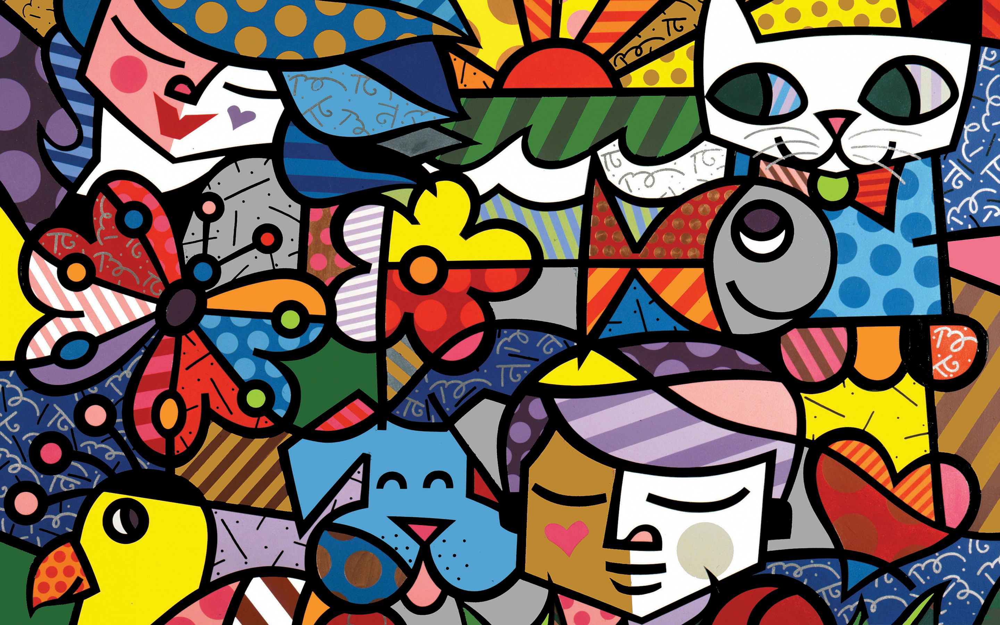
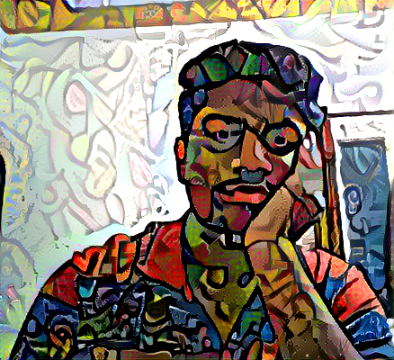
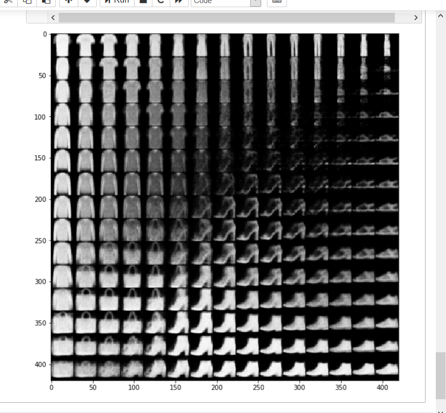
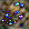

# Generative nature of neural networks

## LSTM

At epoch 1:

After 30 epoch training:
have to say not much of improvement.

## DeepDream

Actual image:

Deepdream image:

## Style Transfer

Initial content image:

Initial style image:

final image:

## Variational autoencoder
To do : work with celeb faces

## Generational Adverserial Networks

After 30 iterations,
real image:

generated image:

